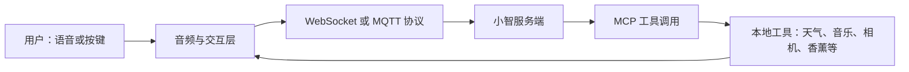

# 项目使用指南

本指南面向首次部署和维护者，覆盖从安装、配置到运行和排错的完整路径。py-xiaozhi 是连接小智服务端的 Python 语音客户端：它负责本地音频、设备交互、界面和 MCP 工具，不是本地大模型或离线语音服务端。

## 项目概览

项目支持实时语音对话、可选视觉能力、唤醒词、快捷键，以及通过 MCP 调用本地工具，例如音量、应用、相机、音乐、截图、天气和香薰控制。它可以运行在桌面系统，也适合部署到鲁班猫-4 等 ARM Linux 设备。



## 结构与职责

| 位置 | 职责 |
| --- | --- |
| `main.py` | 统一启动入口，选择 GUI、CLI、GPIO 和通信协议。 |
| `config/config.json` | 仓库内显式配置模板；固定设备部署时优先维护此文件。 |
| `src/bootstrap/`、`src/core/` | 应用引导、依赖注入、事件与状态等核心能力。 |
| `src/protocols/` | WebSocket 与 MQTT 通信实现。 |
| `src/plugins/`、`src/ui/` | 音频、唤醒词、快捷键及 GUI/CLI/GPIO 交互。 |
| `src/mcp/tools/` | 自动发现的本地工具包，包括 `aroma/`。 |
| `models/`、`libs/`、`assets/` | 随项目使用的模型、原生库和资源。 |
| `documents/` | VitePress 文档站。 |

## 安装与首次运行

准备 Python 3.10 或更高版本、可用网络、麦克风和扬声器。推荐使用 [uv](https://docs.astral.sh/uv/) 管理环境；CLI 和 GPIO 使用基础依赖，GUI 还需要额外依赖。

```bash
git clone <REPOSITORY_URL>
cd py-xiaozhi

# 基础依赖：CLI / GPIO
uv sync

# GUI 额外依赖（仅在需要图形界面时安装）
uv sync --extra gui
```

首次正常使用请完成设备激活。`--skip-activation` 只适合已知环境下的调试，不应用于正式部署。

```bash
# GUI（默认模式；需已安装 gui extra）
uv run python main.py

# 命令行模式
uv run python main.py --mode cli
```

## 统一配置文件

配置来源从高到低依次为：

1. 环境变量 `XIAOZHI_CONFIG_PATH` 指向的 JSON 文件；建议用于保存生产密钥。
2. 仓库或安装目录的 `config/config.json`；鲁班猫-4 固定部署时直接编辑此文件。
3. 旧版用户数据目录中的 `config/config.json`；仅用于兼容已有安装。

发布源码已自带仓库内 `config/config.json`。如果该文件被删除，程序会先使用内置默认值；当需要持久化客户端标识或其他配置时，会尝试重新写入当前配置来源。JSON 格式错误时会保留原文件并使用内置默认值；修改配置后请重启应用。JSON 不支持注释和尾随逗号，修改前应先备份。

仓库中可以保留无密钥模板；实际密钥、令牌、MQTT 凭据和设备标识应放入仓库外的私密文件，再通过环境变量指定：

```bash
export XIAOZHI_CONFIG_PATH=/path/to/private-config.json
uv run python main.py --mode cli
```

Windows PowerShell 示例：

```powershell
$env:XIAOZHI_CONFIG_PATH = 'C:\path\to\private-config.json'
uv run python main.py --mode cli
```

常用顶层配置组如下；以仓库中的 `config/config.json` 为字段参考，不要把真实凭据提交到版本库。

| 配置组 | 用途 |
| --- | --- |
| `SYSTEM_OPTIONS` | 客户端标识、激活和网络连接信息。 |
| `WAKE_WORD_OPTIONS` | 唤醒词模型、词语和响应方式。 |
| `AUDIO_DEVICES` | 输入/输出设备及采样参数。 |
| `CAMERA` | 摄像头与视觉服务选项。 |
| `SHORTCUTS` | 手动说话、自动对话和中断等快捷键。 |
| `LOGGING` | 日志级别、文件输出和脱敏策略。 |
| `AROMA` | 香薰硬件、通道映射和 Qwen 配方规划。 |

## 三种运行模式与协议

| 模式 | 启动命令 | 适用场景 |
| --- | --- | --- |
| GUI | `uv run python main.py` | 有桌面环境，需要图形界面、托盘或快捷键。 |
| CLI | `uv run python main.py --mode cli` | 服务器、鲁班猫-4 和无界面终端。 |
| GPIO | `uv run python main.py --mode gpio` | Linux 上已接好物理按键的嵌入式设备。 |

默认使用 WebSocket。仅当后端明确提供 MQTT 接入信息时才选择 MQTT：

```bash
uv run python main.py --mode cli --protocol mqtt
```

WebSocket 和 MQTT 的连接信息由激活流程或配置提供；不要在文档、终端截图或提交记录中公开访问令牌、密码或设备标识。

所有启动参数如下：

| 参数 | 可选值 / 默认值 | 说明 |
| --- | --- | --- |
| `--mode` | `gui`（默认）、`cli`、`gpio` | 选择图形、命令行或 Linux GPIO 交互方式。 |
| `--protocol` | `websocket`（默认）、`mqtt` | 选择与后端的通信协议。 |
| `--skip-activation` | 无参数开关 | 跳过设备激活，仅用于已知环境下的调试。 |
| `-h`、`--help` | 无 | 显示命令行帮助。 |

## MCP 工具

应用启动时会扫描 `src/mcp/tools/` 的工具包并导入其 `__init__.py` 和 `_tools.py`；被 `@mcp_tool` 标记的异步函数会自动注册。单个工具加载失败只会记录警告，不会阻止其他工具使用。

当前内置工具包括音量、应用、相机、截图、音乐、天气和香薰。模型依据工具描述决定何时调用，例如查询天气时可调用天气工具。新增工具应放在独立子包中，避免修改 MCP 服务端注册代码；开发细节见 [MCP 开发指南](/zh/mcp/)。

## 香薰系统

香薰是一个 MCP 多轮会话功能，使用 DAM1600C 兼容的 Modbus RTU 串口继电器。它默认关闭，进入模式不会立即启动硬件。

### 配置

在私密配置或仓库配置中填写实际硬件参数。以下仅为无密钥示例，所有尖括号内容都必须替换为你的部署值：

```json
{
  "AROMA": {
    "ENABLED": true,
    "SERIAL_PORT": "<SERIAL_PORT>",
    "BAUDRATE": 9600,
    "DEVICE_ADDRESS": 1,
    "SERIAL_TIMEOUT": 1.0,
    "RETRIES": 1,
    "ACTIVE_HIGH": true,
    "MAX_STAGE_SECONDS": 600,
    "MAX_TOTAL_SECONDS": 1800,
    "CHANNEL_MAP": {
      "lavender": 1,
      "bergamot": 2
    },
    "QWEN": {
      "API_KEY": "<YOUR_QWEN_API_KEY>",
      "BASE_URL": "https://dashscope.aliyuncs.com/compatible-mode/v1",
      "MODEL": "qwen3.6-plus"
    }
  }
}
```

`AROMA.ENABLED` 必须为 `true` 且 `AROMA.SERIAL_PORT` 非空，程序才会尝试控制继电器。`CHANNEL_MAP` 中的香型名称必须与实际瓶位和接线一致，通道号只能是 1–16。Qwen 配方生成失败、没有配置 API Key 或返回无效内容时，系统会回退到本地规则；这不影响安全关断逻辑。

### 语音流程

1. 说“开启香薰系统”或“进入香薰模式”，模型调用 `aroma.enter`，系统只进入会话并追问需求。
2. 说明“想放松”“需要专注”“有些困，想提神”或“助眠”等需求，模型调用 `aroma.start(requirement)`。
3. 查询运行情况时，模型调用 `aroma.status`。
4. 说“停止香薰”“退出香薰系统”或“关闭香薰模式”，模型调用 `aroma.exit`，中止任务、关闭 1–16 全部通道并恢复普通聊天。

首次验证必须先断开香薰负载，确认串口、有效电平和通道映射正确后，再以短时、单通道方式接入负载。任何时候都应保留可用的物理断电措施。

## 鲁班猫-4：推荐 CLI 部署

鲁班猫-4 通常没有桌面环境，推荐使用 CLI 模式。将项目与 `config/config.json` 部署到设备后：

```bash
cd /path/to/py-xiaozhi
uv sync
uv run python main.py --mode cli
```

确认系统能识别麦克风、扬声器和串口设备；如使用 GPIO，先完成物理接线并在 Linux 上改用 `--mode gpio`。如当前用户无权访问音频或串口设备，请按设备操作系统的权限模型将该用户加入相应设备组，然后重新登录再运行。不要在启动命令中直接写入密钥。

## 排错

| 现象 | 检查方式 |
| --- | --- |
| GUI 无法启动 | GUI 需要 `uv sync --extra gui`；无显示环境请改用 CLI。 |
| 配置不生效 | 检查 `XIAOZHI_CONFIG_PATH` 是否覆盖仓库配置；确认 JSON 合法，修改后重启。 |
| 激活失败 | 检查网络与设备激活流程；不要在日志中粘贴令牌或设备标识。 |
| 没有声音或无法录音 | 检查系统设备权限和 `AUDIO_DEVICES` 配置，确认麦克风/扬声器未被其他程序占用。 |
| MQTT 连接失败 | 确认后端确实要求 MQTT，并核对私密配置中的连接信息。 |
| 香薰不启动 | 确认 `ENABLED`、串口、`pyserial`、继电器地址、有效电平和通道映射；先断开负载测试。 |
| Qwen 配方不可用 | 检查私密配置中的 API Key、接口地址和网络；系统会使用本地规则回退。 |

日志写入用户数据目录下的 `logs/`，缓存位于同级 `cache/`。提交问题时请只提供必要的脱敏日志，删除 API Key、令牌、密码、设备 ID 和串口等敏感信息。

## 维护建议

- 停止应用后再更新依赖或代码，并在更新前备份私密配置。
- 保持 `config/config.json` 为不含密钥的可部署模板；私密生产配置放在仓库外。
- 修改硬件接线或 `CHANNEL_MAP` 后，先做断载验证。
- 新增 MCP 工具时保持单一职责，使用超时和异常处理，并更新相应文档。
- 清理缓存前先停止程序；不要删除 `models/`、`libs/`、`assets/` 或不确定用途的资源文件。
